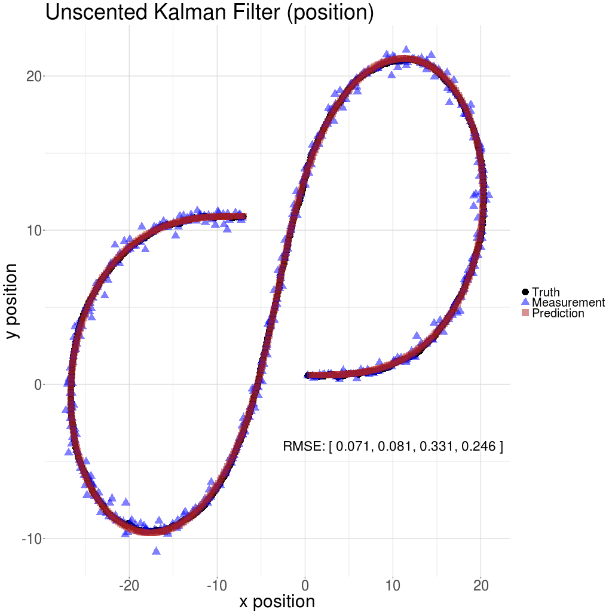
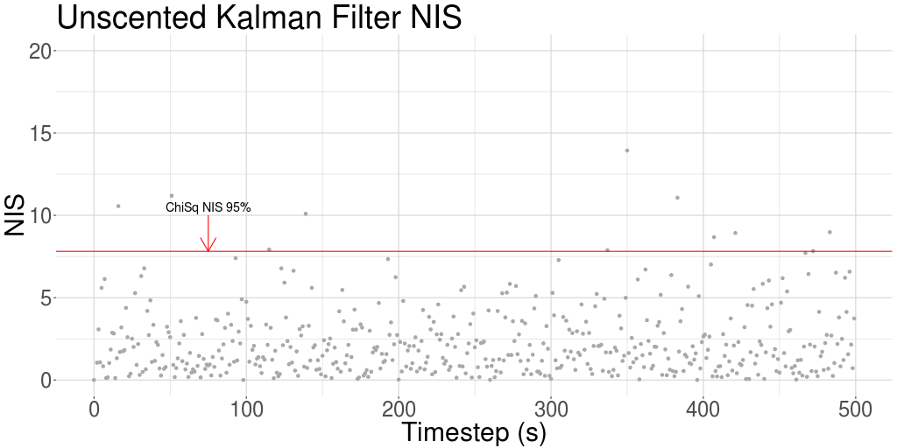

# SDCND Unscented Kalman Filter 
This project is part of the Udacity self-driving car engineer nanodegree.  
Some template code was  provided  by Udacity. Here, apart from minor modifications, the overall architecture of the template was retained for the sake of consistency and ease of evaluation.  

## Results 
The Unscented Kalman Filter is applied to the sample data provided by Udacity. The results are plotted below (see `viz.R`). 

The normalized innovation squared (NIS) is plotted below. A 95% bound based on the Chi-Squared distribution (3 degrees of freedom) is drawn horizontally in red. 

## Dependencies

* cmake >= v3.5
* make >= v4.1
* gcc/g++ >= v5.4
